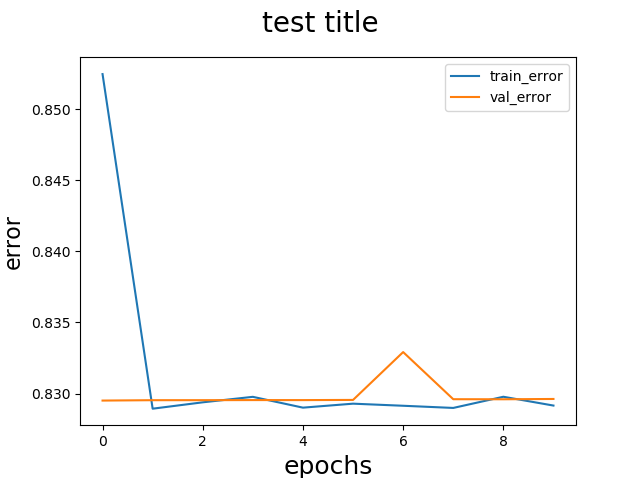

# DLDesign
The modules contain implementation of Neural Network from scratch and is written as a framework. So that the project is expansible
and flexible.

## Usage
```
model = Model()
model.addInput((1,7))
model.addDense(7,activation="relu")
model.addDense(7,activation="relu")
model.addDense(7,activation="sigmoid")
model.addDense(3,activation="relu")
model.addOutput(activation="softmax")
#Set Hyperparameters Default
model.build(loss_function="cross_entropy",learning_rate=0.01,batch_size=16,steps_per_epoch=40,epochs=10)
#description of the model
model.summary()
#initialize layers
model.compile()
#train the model
x,y=model.train(train_data,train_truth,val_data,val_truth)
```
## Visualization

